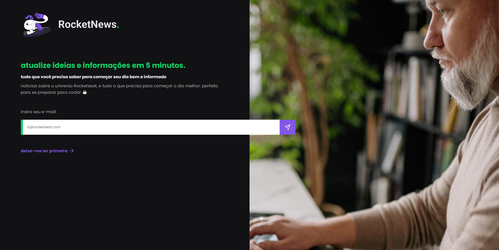

<h1 align="center"> RocketNews </h1>

  RocketNews é um projeto que foi desenvolvido como um dos desafios do discover da Rocketseat. 

  <a href="#-tecnologias">Tecnologias</a>&nbsp;&nbsp;&nbsp;|&nbsp;&nbsp;&nbsp;
  <a href="#-projeto">Projeto</a>&nbsp;&nbsp;&nbsp;|&nbsp;&nbsp;&nbsp;
  <a href="#-layout">Layout</a>&nbsp;&nbsp;&nbsp;&nbsp;&nbsp;&nbsp;

 

  

## 🚀 Tecnologias

Esse projeto foi desenvolvido com as seguintes tecnologias:

- HTML
- CSS

## 💻 Projeto

O RocketNews é uma página de inscrição de newsletter de um portal de noticias do mundo DEV.

## 🔖 Layout

Você pode visualizar o layout do projeto através [DESSE LINK](<https://www.figma.com/file/ltt6BWE8cezRfsEMwtSXdv/DD-%2F-RocketNews-(Copy)?node-id=3%3A2&t=XXAiP3chkDRf2AFz-0>). É necessário ter conta no [Figma](https://figma.com) para acessá-lo.
